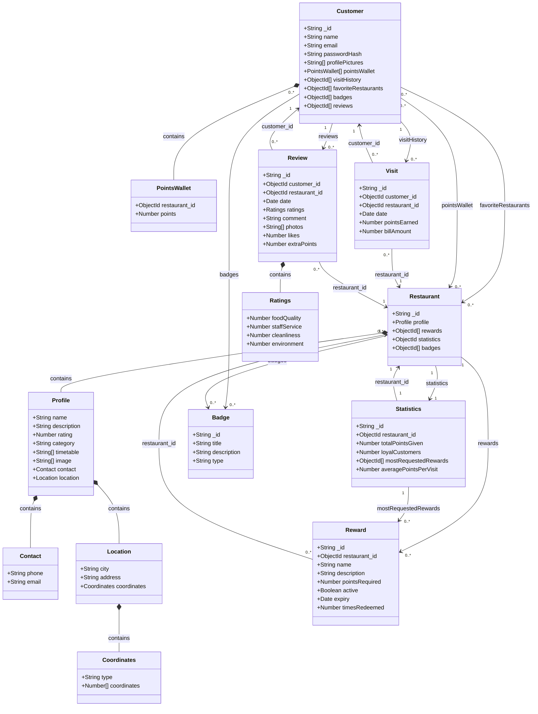

```mermaid

classDiagram
    class Customer {
        +String _id
        +String name
        +String email
        +String passwordHash
        +String[] profilePictures
        +PointsWallet[] pointsWallet
        +ObjectId[] visitHistory
        +ObjectId[] favoriteRestaurants
        +ObjectId[] badges
        +ObjectId[] reviews
    }

    class PointsWallet {
        +ObjectId restaurant_id
        +Number points
    }

    class Restaurant {
        +String _id
        +Profile profile
        +ObjectId[] rewards
        +ObjectId statistics
        +ObjectId[] badges
    }

    class Profile {
        +String name
        +String description
        +Number rating
        +String category
        +String[] timetable
        +String[] image
        +Contact contact
        +Location location
    }

    class Contact {
        +String phone
        +String email
    }

    class Location {
        +String city
        +String address
        +Coordinates coordinates
    }

    class Coordinates {
        +String type
        +Number[] coordinates
    }

    class Visit {
        +String _id
        +ObjectId customer_id
        +ObjectId restaurant_id
        +Date date
        +Number pointsEarned
        +Number billAmount
    }

    class Review {
        +String _id
        +ObjectId customer_id
        +ObjectId restaurant_id
        +Date date
        +Ratings ratings
        +String comment
        +String[] photos
        +Number likes
        +Number extraPoints
    }

    class Ratings {
        +Number foodQuality
        +Number staffService
        +Number cleanliness
        +Number environment
    }

    class Reward {
        +String _id
        +ObjectId restaurant_id
        +String name
        +String description
        +Number pointsRequired
        +Boolean active
        +Date expiry
        +Number timesRedeemed
    }

    class Statistics {
        +String _id
        +ObjectId restaurant_id
        +Number totalPointsGiven
        +Number loyalCustomers
        +ObjectId[] mostRequestedRewards
        +Number averagePointsPerVisit
    }

    class Badge {
        +String _id
        +String title
        +String description
        +String type
    }

    %% Composition (embedded sub-objects)
    Customer *-- PointsWallet : contains

    Restaurant *-- Profile : contains
    Profile *-- Contact : contains
    Profile *-- Location : contains
    Location *-- Coordinates : contains

    Review *-- Ratings : contains

    %% Associations (ObjectId references)
    Customer "1" --> "0..*" Visit : visitHistory
    Customer "1" --> "0..*" Review : reviews
    Customer "0..*" --> "0..*" Restaurant : favoriteRestaurants
    Customer "0..*" --> "0..*" Badge : badges
    Customer "0..*" --> "0..*" Restaurant : pointsWallet

    Restaurant "1" --> "0..*" Reward : rewards
    Restaurant "1" --> "1" Statistics : statistics
    Restaurant "0..*" --> "0..*" Badge : badges

    Visit "0..*" --> "1" Customer : customer_id
    Visit "0..*" --> "1" Restaurant : restaurant_id

    Review "0..*" --> "1" Customer : customer_id
    Review "0..*" --> "1" Restaurant : restaurant_id

    Reward "0..*" --> "1" Restaurant : restaurant_id

    Statistics "1" --> "1" Restaurant : restaurant_id
    Statistics "1" --> "0..*" Reward : mostRequestedRewards

```