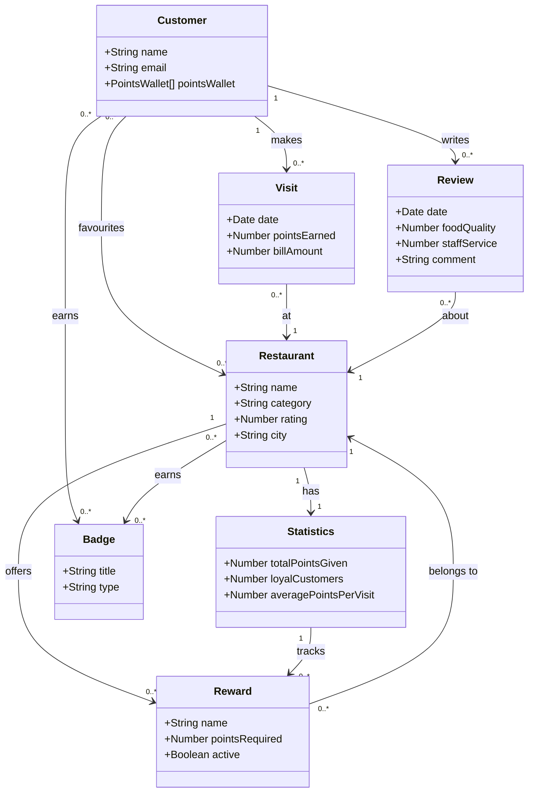

```mermaid
classDiagram
    class Customer {
        +String name
        +String email
        +PointsWallet[] pointsWallet
    }

    class Restaurant {
        +String name
        +String category
        +Number rating
        +String city
    }

    class Visit {
        +Date date
        +Number pointsEarned
        +Number billAmount
    }

    class Review {
        +Date date
        +Number foodQuality
        +Number staffService
        +String comment
    }

    class Reward {
        +String name
        +Number pointsRequired
        +Boolean active
    }

    class Statistics {
        +Number totalPointsGiven
        +Number loyalCustomers
        +Number averagePointsPerVisit
    }

    class Badge {
        +String title
        +String type
    }

    Customer "1" --> "0..*" Visit : makes
    Customer "1" --> "0..*" Review : writes
    Customer "0..*" --> "0..*" Restaurant : favourites
    Customer "0..*" --> "0..*" Badge : earns

    Restaurant "1" --> "0..*" Reward : offers
    Restaurant "1" --> "1" Statistics : has
    Restaurant "0..*" --> "0..*" Badge : earns

    Visit "0..*" --> "1" Restaurant : at
    Review "0..*" --> "1" Restaurant : about
    Reward "0..*" --> "1" Restaurant : belongs to
    Statistics "1" --> "0..*" Reward : tracks
```
